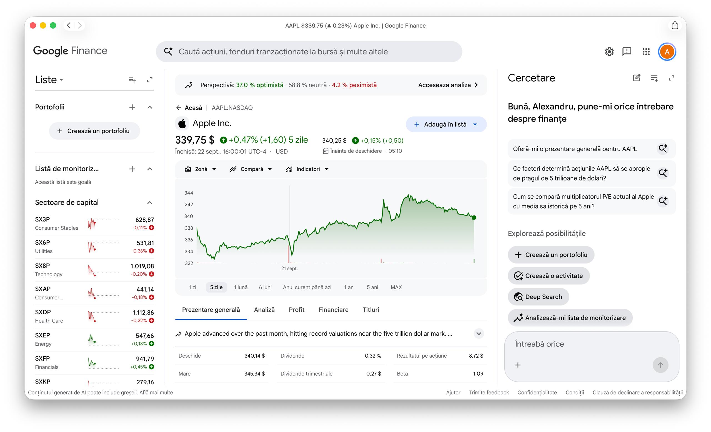
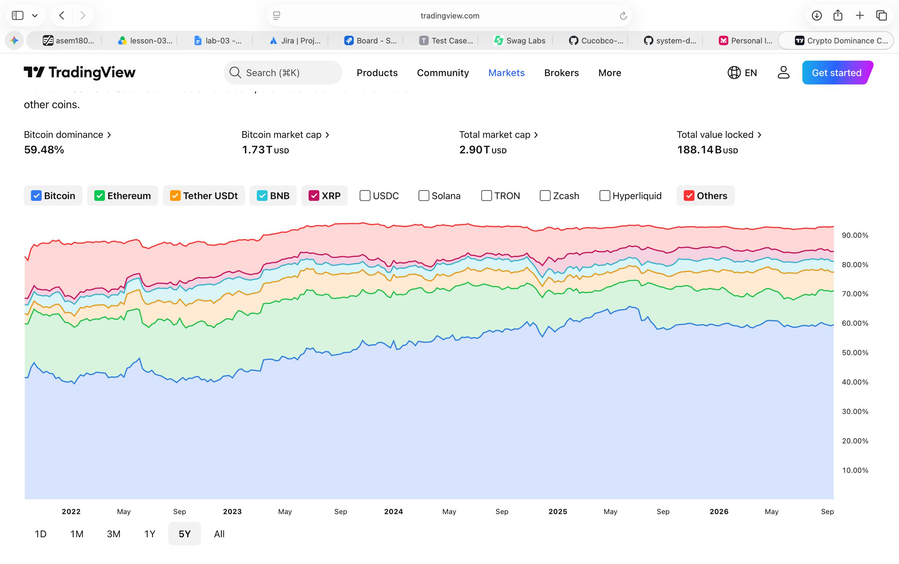

# Lab 1: Define the Initial Product - Personal Investment Dashboard

## 1. Product research

**Research question:** How do existing products help a User follow market information, and which parts belong in this Dashboard's first version?

**Answer:** Existing products help users follow market information by aggregating real-time prices, calculating daily percentage changes, and categorizing assets visually. For this Dashboard's first version, the core reusable parts are the unified watchlist, the daily performance summary, and the asset categorization. Complex technical chart indicators and active trading execution features will be excluded from the initial version.

### Product Evidence

#### Google Finance
* **Public Source:** [Google Finance](https://www.google.com/finance/)
* **Observed Pattern:** Unified Watchlist & Daily Change Summary.
* **Evidence:**


#### TradingView
* **Public Source:** [TradingView](https://www.tradingview.com/)
* **Observed Pattern:** Multi-Asset Holdings Overview & Category Breakdown.
* **Evidence:**


### Comparison Table

| Product | Likely User and goal | Reusable pattern |
| :--- | :--- | :--- |
| **Google Finance** | **Retail Investor** who wants a fast, low-effort overview of daily market movements and watchlist news without logging into a bank. | **Unified Watchlist & Daily Change Summary** (Aggregating stock tickers into custom lists showing real-time price change and percentage). |
| **TradingView** | **Active Trader / Analyst** who wants technical chart analysis, key financial metrics, and multi-asset price tracking. | **Multi-Asset Holdings Overview** (Visualizing asset allocation and tracking total portfolio percentage gain/loss over time). |

## 2. Stakeholders and actors

**Stakeholder Analysis Table:**

| Stakeholder | Motivation | Influence | Reason |
| :--- | :--- | :--- | :--- |
| **Individual Investor (User)** | High | High | They are the primary consumer; product adoption depends entirely on meeting their needs for clarity and ease of use. |
| **Market Data Provider** | Low | High | They supply the raw asset prices; their service terms, pricing, or downtime directly limit product capabilities. |
| **Financial Regulator** | Low | High | They define compliance rules for presenting financial data (e.g., mandating "Not financial advice" disclaimers). |
| **Product Manager** | High | High | They define the product vision, prioritize features, and control the release schedule. |
| **Support Team** | High | Low | They handle user inquiries and are heavily affected by product bugs, but don't dictate the product roadmap. |

**Stakeholder Matrix:**

| | Low influence | High influence |
| :--- | :--- | :--- |
| **High motivation** | Support Team | Individual Investor, Product Manager |
| **Low motivation** | *(None)* | Market Data Provider, Financial Regulator |

**Classification:**
*   **Direct human actor:** Individual Investor (User)
*   **External system:** Market Data Provider
*   **Other stakeholder:** Financial Regulator, Product Manager, Support Team

## 3. Product promise and scope

**Product promise:**
The Personal Investment Dashboard helps the individual investor solve the problem of tracking fragmented investments across multiple sources so that they can make informed financial decisions using a clear, consolidated view of their portfolio performance.

**Goals (User-visible results):**
1. The User can view the total estimated financial value of all their tracked investments in a single currency.
2. The User can observe their daily and overall gains or losses expressed as both monetary values and percentage changes.
3. The User can see a categorical breakdown of their assets (e.g., stocks, crypto) to understand portfolio diversification.
4. The User can monitor current market price updates for assets added to a personal watchlist.
5. The User can easily verify the exact time when their portfolio data and market prices were last updated.

**Non-goals (Removed from first version):**
1. The Dashboard will not execute buy, sell, or transfer transactions for any financial assets.
2. The Dashboard will not automatically connect to external bank accounts or brokerages to pull live transaction history.
3. The Dashboard will not provide automated investment recommendations or personalized financial advice.

## 4. Functional requirements

**DASH-1: Manual Holdings Entry**
*   **Actor goal:** Track owned financial assets by entering holding details.
*   **User story:** As an Individual Investor, I want to manually enter my asset holdings with quantity and purchase price, so that I can track my total portfolio investment baseline.
*   **Definitions of done:**
    *   The system records the entry and immediately updates the displayed total portfolio baseline value.
    *   *Alternative result:* If an invalid entry is made (e.g., negative quantity), the system rejects the entry with a clear validation message.
    *   *Scope limit:* Single base currency tracking only for initial baseline calculations.

**DASH-2: Real-time Portfolio Valuation**
*   **Actor goal:** View current portfolio monetary value and return on investment.
*   **User story:** As an Individual Investor, I want to view my total portfolio value and percentage gain/loss based on latest market rates, so that I can evaluate my financial standing instantly.
*   **Definitions of done:**
    *   The summary displays total value, net profit/loss amount, and total percentage return updated against current market data.
    *   *Alternative result:* If market data is unavailable or out-of-date, the system displays the last known valuation alongside a visible "Data Stale / Offline" indicator and timestamp.

**DASH-3: Custom Asset Watchlist**
*   **Actor goal:** Monitor potential investment opportunities without purchasing them.
*   **User story:** As an Individual Investor, I want to create and manage a watchlist of market tickers, so that I can monitor market movements without impacting my main portfolio metrics.
*   **Definitions of done:**
    *   Adding a ticker displays its current market price and daily percentage change on the user's watchlist.
    *   *Alternative result:* If an entered ticker symbol does not exist or is unsupported, the system displays an "Asset Ticker Not Found" message and leaves the list unchanged.

**DASH-4: Asset Allocation Breakdown**
*   **Actor goal:** Understand portfolio risk distribution across asset types.
*   **User story:** As an Individual Investor, I want to see a percentage breakdown of my portfolio by asset class, so that I can assess my portfolio diversification.
*   **Definitions of done:**
    *   The summary calculates and displays the exact percentage distribution of total value across all recorded asset classes.
    *   *Important alternative result:* If a user adds a custom asset without a predefined class, it is automatically categorized and displayed under "Other".

**DASH-5: Data Freshness Verification**
*   **Actor goal:** Ensure the financial data being reviewed is current.
*   **User story:** As an Individual Investor, I want to see the timestamp of the last successful market data refresh, so that I can trust the accuracy of my portfolio valuation.
*   **Definitions of done:**
    *   A timestamp is always visible indicating when the prices were last synced.
    *   *Alternative result:* If the refresh fails due to an unauthorized access error with the data provider, the dashboard shows an "Update Failed: Access Denied" warning prompt.

## 5. C4 System Context

```mermaid
flowchart TD
    %% Stiluri C4
    classDef person fill:#08427b,color:#fff,stroke:#052e56,stroke-width:2px,rx:50,ry:50
    classDef system fill:#1168bd,color:#fff,stroke:#0b4884,stroke-width:2px,rx:10,ry:10
    classDef external fill:#999999,color:#fff,stroke:#666666,stroke-width:2px,rx:10,ry:10

    %% Noduri (Actori si Sisteme)
    User("👤 Individual Investor<br/>[Person]<br/><br/>A retail investor who tracks<br/>personal investments."):::person
    
    Dashboard["Personal Investment Dashboard<br/>[Software System]<br/><br/>Consolidates asset holdings,<br/>calculates portfolio performance,<br/>and displays market watchlists."]:::system
    
    MarketData["Market Data Provider<br/>[Software System]<br/><br/>External financial data feed<br/>supplying asset prices."]:::external

    %% Relatii
    User -- "Views portfolio valuation,<br/>enters holdings, and<br/>manages watchlists" --> Dashboard
    Dashboard -- "Fetches market prices<br/>and ticker updates" --> MarketData
    
    %% Relatie de returnare erori
    MarketData -."Missing: Last known value + warning<br/>Stale: Yellow indicator + timestamp<br/>Unsupported: Inline notification".-> Dashboard
